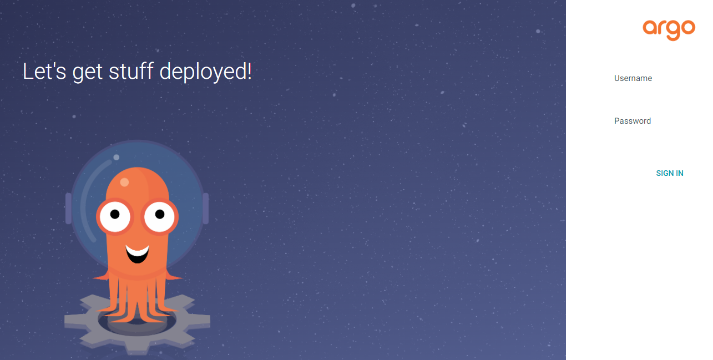
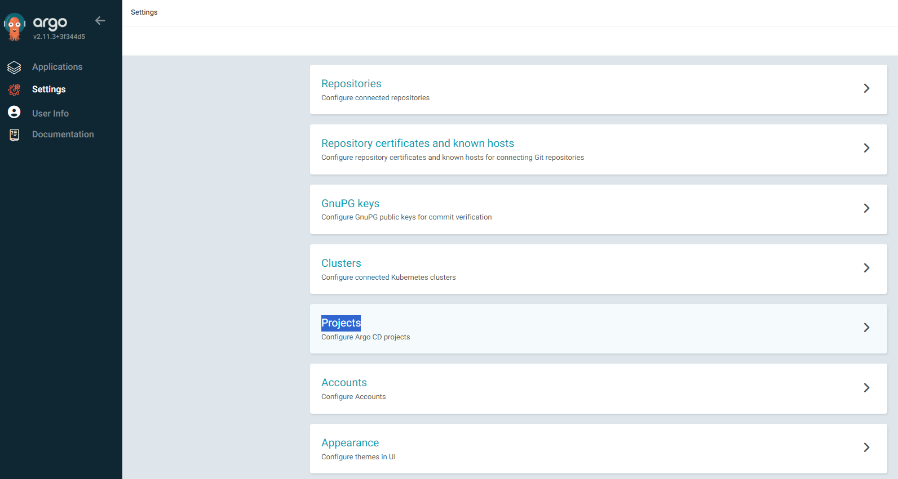
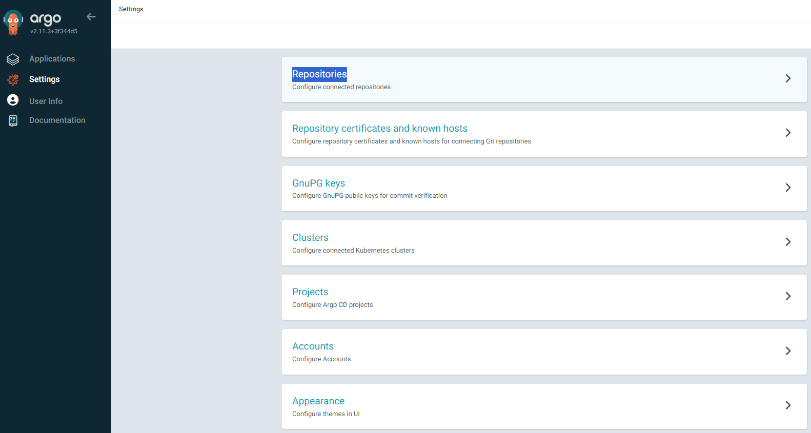
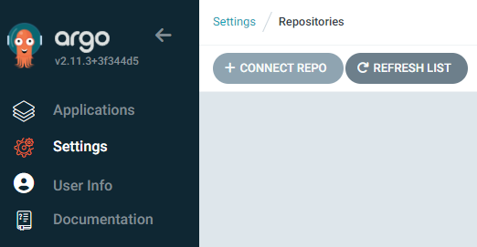
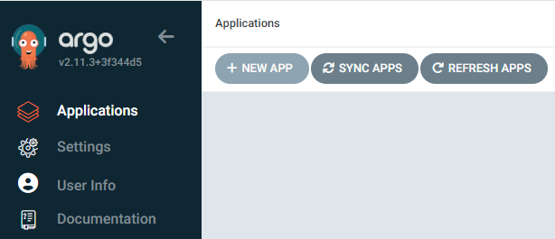
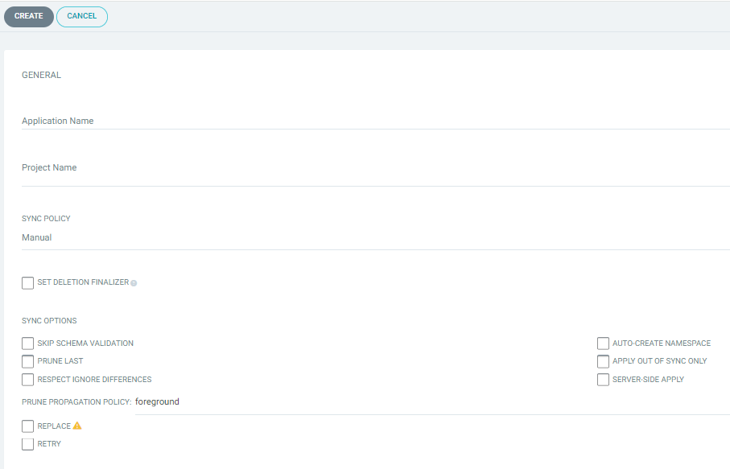
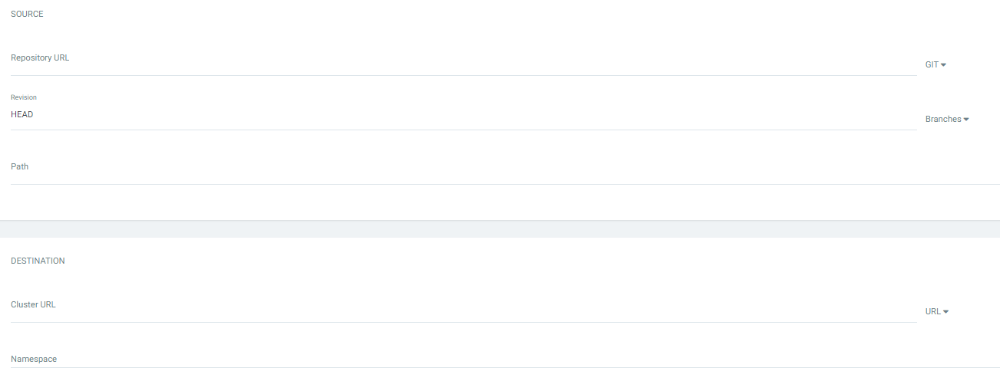
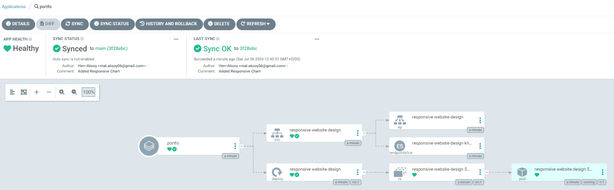

# Argocd Integration into Azure Kubernetes Cluster

## Create to Azure Kubernetes Cluster

### Step 1- Update Azure CLI and sign in:

```sh

az upgrade
az login

``` 

### Step 2- Create a Resource Group:

You can write your own resource group name instead of **'MyAKS-rg'** and your preferred region instead of **'westeurope'**

```sh

az group create --name MyAKS-rg --location westeurope 

```

### Step 3- Create an AKS Cluster:

In this command, we specify the virtual machine SKU that the nodes will use with the **'--node-vm-size'** parameter. Different SKUs have different CPU and memory capacities, such as **'Standard_D4s_v3'**. For example, the **'Standard_D4s_v3'** SKU includes 4 vCPUs and 16 GB RAM.

```sh

az aks create \
    --resource-group MyAKS-rg \
    --name MyAKSCluster \
    --node-count 1 \
    --node-vm-size Standard_D4s_v3 \
    --generate-ssh-keys \
    --enable-node-public-ip \
    --location northeurope \
    --debug

``` 

**❗Example size:** Standard_B2s  


Commands to delete the created Kubernetes Cluster. At the end of our work, you can remove the cluster.

```sh

az aks delete \
    --resource-group MyAKS-rg \
    --name MyAKSCluster \
    --yes --verbose

```   


### Step 4- Download and set the kubectl configuration file:

This command downloads and sets the kubectl configuration file required to access your AKS cluster.

```sh

az aks get-credentials --resource-group MyAKS-rg --name MyAKSCluster --overwrite-existing

``` 

### Step5- Verify that the cluster is running:

With this command, you can see the list of nodes and verify that the cluster is working properly.

```sh

kubectl get nodes

``` 
# What is ArgoCD?

ArgoCD is a GitOps continuous delivery tool used to manage applications in Kubernetes clusters. The GitOps approach ensures that application and infrastructure codes are kept in a Git repository and changes in this repository are automatically applied to Kubernetes clusters.

## Purpose of ArgoCD

The main goal of ArgoCD is to improve the software delivery process by automating application deployments and configuration management. By adopting the GitOps approach, it makes application deployments more reliable, traceable and scalable.

## Benefits of ArgoCD

**Automatic Deployment:** Every change made to the Git repository is automatically applied to Kubernetes clusters by ArgoCD. This reduces manual intervention and speeds up the deployment process. Version Control: Since all application and configuration changes are stored in Git, every change can be tracked and reverted. This ensures quick response in case of errors.  

**Traceability and Visualization:** Traceability and Visualization: ArgoCD offers the opportunity to visually monitor application statuses and deployment processes. Thanks to its web-based interface, you can easily see which application is in which version.  

**Notifications and Warnings:** ArgoCD sends notifications and alerts about errors or problems that may occur in the deployment processes. In this way, rapid intervention is possible. Rollout Strategies: Supports rollout strategies such as canary deployments, blue-green deployments. This provides safer and more controlled distribution processes.
Cluster Expansion: ArgoCD is capable of managing multiple Kubernetes clusters. This enables central management of applications in different environments (test, staging, prod).

## What Can Be Managed with ArgoCD

**Application Deployments:** Any application running on Kubernetes can be deployed via ArgoCD. This includes microservices architectures, monolithic applications, databases and more.  

**Configuration Files:** Configuration components such as Kubernetes manifest files (YAML/JSON), ConfigMaps, Secrets can be managed.  

**Infrastructure Components:** Infrastructure configurations such as network components, security policies, RBAC settings needed at the cluster level can be managed.  

**Helm Charts:** Packaging and deploying applications using Helm charts is supported. Kustomize: Using Kustomize, patching and management of Kubernetes YAML files can be done.

## ArgoCD Usage Scenarios

**Continuous Integration/Continuous Delivery (CI/CD):** Integrating with CI tools, automatically testing code changes and distributing successful ones to Kubernetes clusters.  

**Multiple Environment Management:** Consistent and automatic management of applications in different environments such as testing, staging and production.  

**Automatic Rollback:** In case of a faulty deployment, automatic rollback to the previous stable version. ArgoCD is a powerful and flexible tool for teams working on Kubernetes. Thanks to the GitOps methodology, it ensures that deployment processes are more reliable, traceable and manageable. This makes the job of software development and operations teams easier and increases overall efficiency.


#  Installing Argocd in a Kubernetes Cluster

**Internet sitesi:** https://argo-cd.readthedocs.io/en/stable/getting_started/

**Commands:**

```sh

kubectl create namespace argocd
kubectl apply -n argocd -f https://raw.githubusercontent.com/argoproj/argo-cd/stable/manifests/install.yaml

```

Convert Argocd service to LoadBalancer type.

```sh

kubectl patch svc argocd-server -n argocd -p '{"spec": {"type": "LoadBalancer"}}'

```

After Argocd installation, you need secret information to connect to the service. Since the installation is done from the ready-made Helm chart, the secrets come embedded in the Chart.  
Let me view the secrets with this command.

```sh

kubectl get secret -n argocd 

```

When you open the secret named argocd-initial-admin-secret with the following command, you will see the password.

```sh

kubectl get secret argocd-initial-admin-secret -n argocd  -o yaml

```

Since the password is encrypted with base64, you must unlock the password with this command.

```sh

echo "< Password >" | base64 -d

```

Reorder the created services. And log in from the Browser with the assigned Public IP.

```sh

kubectl get svc -n argocd

```

Enter the admin username and password in the Argocd interface that opens.





# Argocd > Settings > Projects configuration

The **"Projects"** section on the Argo CD provides a powerful tool to better organize, isolate and manage applications, users and resources. This both increases security and simplifies management in large-scale installations. Each project acts as an independent management unit on its own, allowing teams to manage their own workloads more effectively.



### 1- Insulation and Security

**Cross-Team Isolation:** Different teams or departments can manage their own applications within separate projects. This way, changes made by one team do not affect other teams.  

**Security Policies:** You can define specific access controls for each project. This allows you to control which users or roles can access or make changes to certain projects.

### 2- Resource Management

**Resource Quotas:** Projects can be configured with specific resource usage quotas. For example, you can allow a particular project to use a certain number of applications or a certain amount of resources.  

**Resource Boundaries:** By defining which resource pools (e.g. Git repositories, Kubernetes clusters) can be used by which projects, you can ensure that resources are managed and used correctly.

### 3- Application Grouping

**Logical Grouping:** Can be used to logically group applications associated with a project, a specific business unit, product, or customer. This makes it easier to manage and monitor applications.

**Shared Settings:** Settings defined at the project level (e.g., access to a specific GitHub organization) can be applied to all applications in the project, making the settings consistent and easy to manage.

### 4- Policy Implementation

**Open Policy Management:** You can manage and enforce application policies through projects. For example, you can only allow deployments from a specific branch for a specific project.

**Security Policies:** By setting RBAC (Role-Based Access Control) rules, you can control which users or teams can perform which actions on which projects.

### 5- Multi-Tenancy Support

**Multi-tenancy:** Projects make it possible to use Argo CD in multi-tenancy environments. This allows multiple users or teams to use the same Argo CD server but remain isolated in their own projects.

# Argocd > Settings > Repositories configuration

The "Repositories" section in the Argo CD interface is a critical component for managing Git repositories that form the basis of application deployments. This section provides all the necessary settings and configurations to effectively manage GitOps processes, allowing application deployments to be done automatically and securely.  



### 1- Defining Git Repositories

**Add Link:** Used to add new Git repositories to the Argo CD. This defines the repositories from which Argo CD will retrieve application manifest files (e.g. Helm charts, Kustomize directories, plain YAML files).

**Multiple Repository Support:** You can add and manage multiple Git repositories. This allows you to use different repositories for different projects or teams.

### 2- Authentication and Access Management

**Authentication Information:** You can define access credentials (e.g. SSH keys, personal access tokens) for each repository. This allows Argo CD to access private repositories.  

**Secure Access:** Authentication and authorization information is stored here for secure management of repositories. This ensures that only authorized users have access to certain repositories.

### 3- Repository Configuration and Settings

**Repository URL:** The URL of the Git repository, which allows Argo CD to link to this repository.

**Proxy and TLS Settings:** You can manage proxy settings and TLS configurations as needed. This is important for secure connections and network configurations.

### 4- Repository Types and Support

**Various Git Platforms:** Supports different Git platforms such as GitHub, GitLab, Bitbucket. This allows you to integrate your organization's existing Git infrastructure with Argo CD.  

**Repository Formats:** Supports repositories in different formats and layouts (e.g. Helm chart repositories, Kustomize directories).

### 5- Access Policies

**Warehouse-Based Policy Application:** You can define specific policies for each warehouse. For example, you can allow only certain branches to be used.

**RBAC Support:** With Role-Based Access Control (RBAC), you can manage which users can access and make changes to which repositories.

### 6- Auto Sync and Tracking

**Change Tracking:** Argo CD can automatically track changes to defined Git repositories and sync those changes to the Kubernetes cluster.  

**Notifications and Alerts:** Can configure notifications and alerts about changes made to repositories. This makes it easier for teams to track changes and sync statuses.

<br><br>

We make Repo connections for the application we want to create.

<table>
  <tr>
    <td></td>
    <td></td>
    <td></td>
  </tr>
    <tr>
    <td><a  title="Settings">Connet-Repo</a></td>
    <td><a  title="Settings">Repo-settings</a></td>
    <td><a  title="Settings">Repo-Successful</a></td>
  </tr>
</table>

<br><br>

# Creating the application

<br><br>

### Step 1- Click the "New App" button.



<br><br>

### Step 2- Fill in the application information in the General tab:

**Application Name:** The name of the application.  

**Project:** The project to which the application belongs (default may be default).  

**Sync Policy:** Select the synchronization policy (Manual or Automated).



<br><br>

### Step 3- In the Source tab, fill in the source information:

**Repository URL:** Git repository URL.  

**Revision:** The Git branch you want to use (for example, main or master).  

**Path:** The directory where Kubernetes manifest files are located (for example, path/to/manifests).

 

### Step 4- In the Destination tab, fill in the target cluster information:

**Cluster URL:** API URL of the target Kubernetes cluster (https://kubernetes.default.svc is usually the default local cluster URL).

**Namespace:** The Kubernetes namespace (for example, default) where the application will be deployed.

<br><br>

After pressing the Create button, the application will be created by Argocd as follows.  





